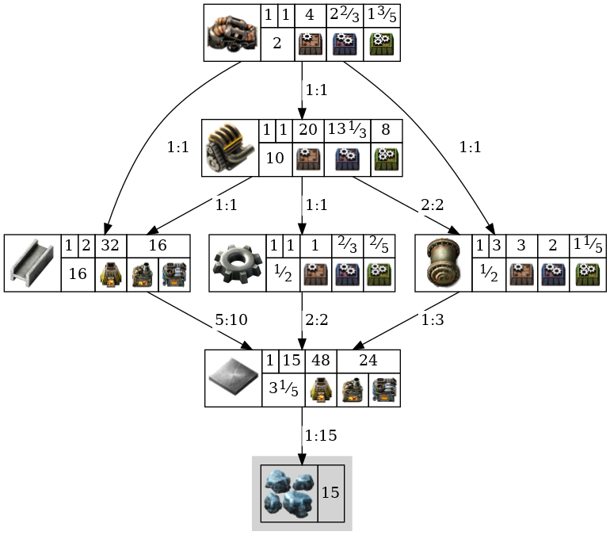
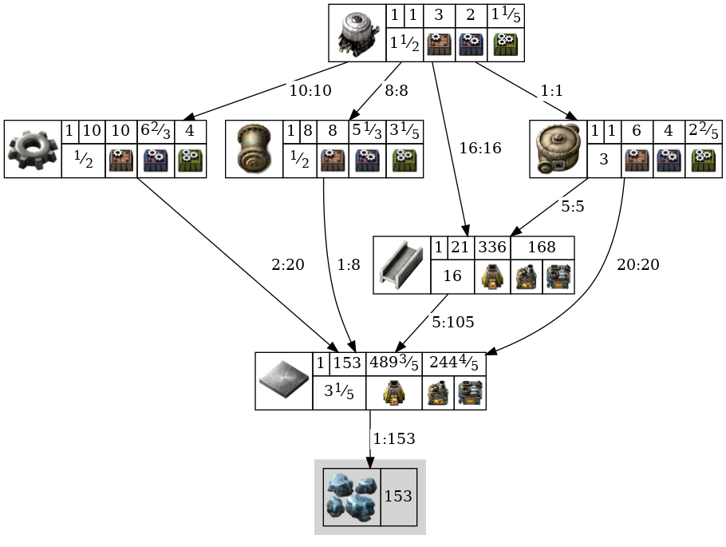
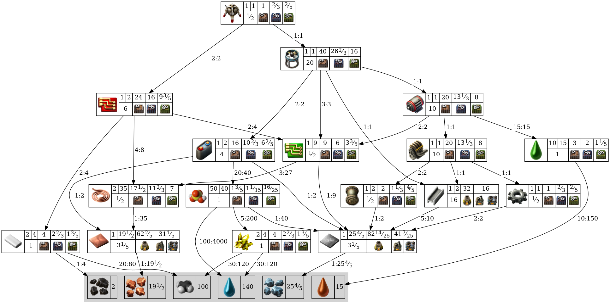
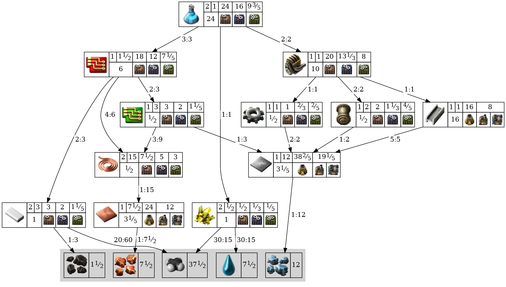
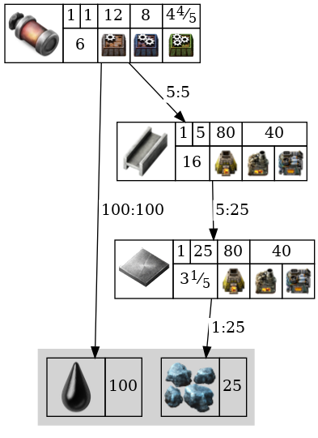

```bash
npx ts-node .
```
### Wooden chest
[wiki](https://wiki.factorio.com/Wooden_chest)

---
### Iron chest
[wiki](https://wiki.factorio.com/Iron_chest)

---
### Steel chest
[wiki](https://wiki.factorio.com/Steel_chest)

---
### Storage tank
[wiki](https://wiki.factorio.com/Storage_tank)

---
### Transport belt
[wiki](https://wiki.factorio.com/Transport_belt)

---
### Fast transport belt
[wiki](https://wiki.factorio.com/Fast_transport_belt)

---
### Express transport belt
[wiki](https://wiki.factorio.com/Express_transport_belt)

---
### Underground belt
[wiki](https://wiki.factorio.com/Underground_belt)

---
### Fast underground belt
[wiki](https://wiki.factorio.com/Fast_underground_belt)

---
### Express underground belt
[wiki](https://wiki.factorio.com/Express_underground_belt)

---
### Splitter
[wiki](https://wiki.factorio.com/Splitter)

---
### Fast splitter
[wiki](https://wiki.factorio.com/Fast_splitter)

---
### Express splitter
[wiki](https://wiki.factorio.com/Express_splitter)

---
### Burner inserter
[wiki](https://wiki.factorio.com/Burner_inserter)

---
### Inserter
[wiki](https://wiki.factorio.com/Inserter)

---
### Long-handed inserter
[wiki](https://wiki.factorio.com/Long-handed_inserter)

---
### Fast inserter
[wiki](https://wiki.factorio.com/Fast_inserter)

---
### Filter inserter
[wiki](https://wiki.factorio.com/Filter_inserter)

---
### Stack inserter
[wiki](https://wiki.factorio.com/Stack_inserter)

---
### Stack filter inserter
[wiki](https://wiki.factorio.com/Stack_filter_inserter)

---
### Small electric pole
[wiki](https://wiki.factorio.com/Small_electric_pole)

---
### Medium electric pole
[wiki](https://wiki.factorio.com/Medium_electric_pole)

---
### Big electric pole
[wiki](https://wiki.factorio.com/Big_electric_pole)

---
### Substation
[wiki](https://wiki.factorio.com/Substation)

---
### Pipe
[wiki](https://wiki.factorio.com/Pipe)

---
### Pipe to ground
[wiki](https://wiki.factorio.com/Pipe_to_ground)

---
### Pump
[wiki](https://wiki.factorio.com/Pump)

---
### Straight rail
[wiki](https://wiki.factorio.com/Rail)

---
### Train stop
[wiki](https://wiki.factorio.com/Train_stop)

---
### Rail signal
[wiki](https://wiki.factorio.com/Rail_signal)

---
### Rail chain signal
[wiki](https://wiki.factorio.com/Rail_chain_signal)

---
### Locomotive
[wiki](https://wiki.factorio.com/Locomotive)

---
### Cargo wagon
[wiki](https://wiki.factorio.com/Cargo_wagon)

---
### Fluid wagon
[wiki](https://wiki.factorio.com/Fluid_wagon)

---
### Artillery wagon
[wiki](https://wiki.factorio.com/Artillery_wagon)

---
### Car
[wiki](https://wiki.factorio.com/Car)

---
### Tank
[wiki](https://wiki.factorio.com/Tank)

---
### Spidertron
[wiki](https://wiki.factorio.com/Spidertron)

---
### Spidertron remote
[wiki](https://wiki.factorio.com/Spidertron_remote)

---
### Logistic robot
[wiki](https://wiki.factorio.com/Logistic_robot)

---
### Construction robot
[wiki](https://wiki.factorio.com/Construction_robot)

---
### Active provider chest
[wiki](https://wiki.factorio.com/Active_provider_chest)

---
### Passive provider chest
[wiki](https://wiki.factorio.com/Passive_provider_chest)

---
### Storage chest
[wiki](https://wiki.factorio.com/Storage_chest)

---
### Buffer chest
[wiki](https://wiki.factorio.com/Buffer_chest)

---
### Requester chest
[wiki](https://wiki.factorio.com/Requester_chest)

---
### Roboport
[wiki](https://wiki.factorio.com/Roboport)

---
### Lamp
[wiki](https://wiki.factorio.com/Lamp)

---
### Red wire
[wiki](https://wiki.factorio.com/Red_wire)

---
### Green wire
[wiki](https://wiki.factorio.com/Green_wire)

---
### Arithmetic combinator
[wiki](https://wiki.factorio.com/Arithmetic_combinator)

---
### Decider combinator
[wiki](https://wiki.factorio.com/Decider_combinator)

---
### Constant combinator
[wiki](https://wiki.factorio.com/Constant_combinator)

---
### Power switch
[wiki](https://wiki.factorio.com/Power_switch)

---
### Programmable speaker
[wiki](https://wiki.factorio.com/Programmable_speaker)

---
### Stone brick
[wiki](https://wiki.factorio.com/Stone_brick)

---
### Concrete
[wiki](https://wiki.factorio.com/Concrete)

---
### Hazard concrete
[wiki](https://wiki.factorio.com/Hazard_concrete)

---
### Refined concrete
[wiki](https://wiki.factorio.com/Refined_concrete)

---
### Refined hazard concrete
[wiki](https://wiki.factorio.com/Refined_hazard_concrete)

---
### Landfill
[wiki](https://wiki.factorio.com/Landfill)

---
### Cliff explosives
[wiki](https://wiki.factorio.com/Cliff_explosives)

---
### Repair pack
[wiki](https://wiki.factorio.com/Repair_pack)

---
### Blueprint
[wiki](https://wiki.factorio.com/Blueprint)

---
### Deconstruction planner
[wiki](https://wiki.factorio.com/Deconstruction_planner)

---
### Upgrade planner
[wiki](https://wiki.factorio.com/Upgrade_planner)

---
### Blueprint book
[wiki](https://wiki.factorio.com/Blueprint_book)

---
### Boiler
[wiki](https://wiki.factorio.com/Boiler)

---
### Steam engine
[wiki](https://wiki.factorio.com/Steam_engine)

---
### Solar panel
[wiki](https://wiki.factorio.com/Solar_panel)

---
### Accumulator
[wiki](https://wiki.factorio.com/Accumulator)

---
### Nuclear reactor
[wiki](https://wiki.factorio.com/Nuclear_reactor)

---
### Heat pipe
[wiki](https://wiki.factorio.com/Heat_pipe)

---
### Heat exchanger
[wiki](https://wiki.factorio.com/Heat_exchanger)

---
### Steam turbine
[wiki](https://wiki.factorio.com/Steam_turbine)

---
### Burner mining drill
[wiki](https://wiki.factorio.com/Burner_mining_drill)

---
### Electric mining drill
[wiki](https://wiki.factorio.com/Electric_mining_drill)

---
### Offshore pump
[wiki](https://wiki.factorio.com/Offshore_pump)

---
### Pumpjack
[wiki](https://wiki.factorio.com/Pumpjack)

---
### Stone furnace
[wiki](https://wiki.factorio.com/Stone_furnace)

---
### Steel furnace
[wiki](https://wiki.factorio.com/Steel_furnace)

---
### Electric furnace
[wiki](https://wiki.factorio.com/Electric_furnace)

---
### Assembling machine 1
[wiki](https://wiki.factorio.com/Assembling_machine_1)

---
### Assembling machine 2
[wiki](https://wiki.factorio.com/Assembling_machine_2)

---
### Assembling machine 3
[wiki](https://wiki.factorio.com/Assembling_machine_3)

---
### Oil refinery
[wiki](https://wiki.factorio.com/Oil_refinery)

---
### Chemical plant
[wiki](https://wiki.factorio.com/Chemical_plant)

---
### Centrifuge
[wiki](https://wiki.factorio.com/Centrifuge)

---
### Lab
[wiki](https://wiki.factorio.com/Lab)

---
### Beacon
[wiki](https://wiki.factorio.com/Beacon)

---
### Speed module
[wiki](https://wiki.factorio.com/Speed_module)

---
### Speed module 2
[wiki](https://wiki.factorio.com/Speed_module_2)

---
### Speed module 3
[wiki](https://wiki.factorio.com/Speed_module_3)

---
### Efficiency module
[wiki](https://wiki.factorio.com/Efficiency_module)

---
### Efficiency module 2
[wiki](https://wiki.factorio.com/Efficiency_module_2)

---
### Efficiency module 3
[wiki](https://wiki.factorio.com/Efficiency_module_3)

---
### Productivity module
[wiki](https://wiki.factorio.com/Productivity_module)

---
### Productivity module 2
[wiki](https://wiki.factorio.com/Productivity_module_2)

---
### Productivity module 3
[wiki](https://wiki.factorio.com/Productivity_module_3)

---
### Rocket silo
[wiki](https://wiki.factorio.com/Rocket_silo)

---
### Satellite
[wiki](https://wiki.factorio.com/Satellite)

---
### Crude oil
[wiki](https://wiki.factorio.com/Crude_oil)

---
### Heavy oil
[wiki](https://wiki.factorio.com/Heavy_oil)

---
### Light oil
[wiki](https://wiki.factorio.com/Light_oil)

---
### Lubricant
[wiki](https://wiki.factorio.com/Lubricant)

---
### Petroleum gas
[wiki](https://wiki.factorio.com/Petroleum_gas)

---
### Sulfuric acid
[wiki](https://wiki.factorio.com/Sulfuric_acid)

---
### Water
[wiki](https://wiki.factorio.com/Water)

---
### Steam
[wiki](https://wiki.factorio.com/Steam)

---
### Wood
[wiki](https://wiki.factorio.com/Wood)

---
### Coal
[wiki](https://wiki.factorio.com/Coal)

---
### Stone
[wiki](https://wiki.factorio.com/Stone)

---
### Iron ore
[wiki](https://wiki.factorio.com/Iron_ore)

---
### Copper ore
[wiki](https://wiki.factorio.com/Copper_ore)

---
### Uranium ore
[wiki](https://wiki.factorio.com/Uranium_ore)

---
### Raw fish
[wiki](https://wiki.factorio.com/Raw_fish)

---
### Iron plate
[wiki](https://wiki.factorio.com/Iron_plate)

---
### Copper plate
[wiki](https://wiki.factorio.com/Copper_plate)

---
### Solid fuel
[wiki](https://wiki.factorio.com/Solid_fuel)

---
### Steel plate
[wiki](https://wiki.factorio.com/Steel_plate)

---
### Plastic bar
[wiki](https://wiki.factorio.com/Plastic_bar)

---
### Sulfur
[wiki](https://wiki.factorio.com/Sulfur)

---
### Battery
[wiki](https://wiki.factorio.com/Battery)

---
### Explosives
[wiki](https://wiki.factorio.com/Explosives)

---
### Uranium processing
[wiki](https://wiki.factorio.com/Uranium_processing)

---
### Crude oil barrel
[wiki](https://wiki.factorio.com/Crude_oil_barrel)

---
### Heavy oil barrel
[wiki](https://wiki.factorio.com/Heavy_oil_barrel)

---
### Light oil barrel
[wiki](https://wiki.factorio.com/Light_oil_barrel)

---
### Lubricant barrel
[wiki](https://wiki.factorio.com/Lubricant_barrel)

---
### Petroleum gas barrel
[wiki](https://wiki.factorio.com/Petroleum_gas_barrel)

---
### Sulfuric acid barrel
[wiki](https://wiki.factorio.com/Sulfuric_acid_barrel)

---
### Water barrel
[wiki](https://wiki.factorio.com/Water_barrel)

---
### Copper cable
[wiki](https://wiki.factorio.com/Copper_cable)

---
### Iron stick
[wiki](https://wiki.factorio.com/Iron_stick)

---
### Iron gear wheel
[wiki](https://wiki.factorio.com/Iron_gear_wheel)

---
### Empty barrel
[wiki](https://wiki.factorio.com/Empty_barrel)

---
### Electronic circuit
[wiki](https://wiki.factorio.com/Electronic_circuit)

---
### Advanced circuit
[wiki](https://wiki.factorio.com/Advanced_circuit)

---
### Processing unit
[wiki](https://wiki.factorio.com/Processing_unit)

---
### Engine unit
[wiki](https://wiki.factorio.com/Engine_unit)

---
### Electric engine unit
[wiki](https://wiki.factorio.com/Electric_engine_unit)

---
### Flying robot frame
[wiki](https://wiki.factorio.com/Flying_robot_frame)

---
### Rocket part
[wiki](https://wiki.factorio.com/Rocket_part)

---
### Rocket control unit
[wiki](https://wiki.factorio.com/Rocket_control_unit)

---
### Low density structure
[wiki](https://wiki.factorio.com/Low_density_structure)

---
### Rocket fuel
[wiki](https://wiki.factorio.com/Rocket_fuel)

---
### Nuclear fuel
[wiki](https://wiki.factorio.com/Nuclear_fuel)

---
### Uranium-235
[wiki](https://wiki.factorio.com/Uranium-235)

---
### Uranium-238
[wiki](https://wiki.factorio.com/Uranium-238)

---
### Uranium fuel cell
[wiki](https://wiki.factorio.com/Uranium_fuel_cell)

---
### Nuclear fuel reprocessing
[wiki](https://wiki.factorio.com/Nuclear_fuel_reprocessing)

---
### Kovarex enrichment process
[wiki](https://wiki.factorio.com/Kovarex_enrichment_process)

---
### Used up uranium fuel cell
[wiki](https://wiki.factorio.com/Used_up_uranium_fuel_cell)

---
### Automation science pack
[wiki](https://wiki.factorio.com/Automation_science_pack)

---
### Logistic science pack
[wiki](https://wiki.factorio.com/Logistic_science_pack)

---
### Military science pack
[wiki](https://wiki.factorio.com/Military_science_pack)

---
### Chemical science pack
[wiki](https://wiki.factorio.com/Chemical_science_pack)

---
### Production science pack
[wiki](https://wiki.factorio.com/Production_science_pack)

---
### Utility science pack
[wiki](https://wiki.factorio.com/Utility_science_pack)

---
### Space science pack
[wiki](https://wiki.factorio.com/Space_science_pack)

---
### Pistol
[wiki](https://wiki.factorio.com/Pistol)

---
### Submachine gun
[wiki](https://wiki.factorio.com/Submachine_gun)

---
### Shotgun
[wiki](https://wiki.factorio.com/Shotgun)

---
### Combat shotgun
[wiki](https://wiki.factorio.com/Combat_shotgun)

---
### Rocket launcher
[wiki](https://wiki.factorio.com/Rocket_launcher)

---
### Flamethrower
[wiki](https://wiki.factorio.com/Flamethrower)

---
### Land mine
[wiki](https://wiki.factorio.com/Land_mine)

---
### Firearm magazine
[wiki](https://wiki.factorio.com/Firearm_magazine)

---
### Piercing rounds magazine
[wiki](https://wiki.factorio.com/Piercing_rounds_magazine)

---
### Uranium rounds magazine
[wiki](https://wiki.factorio.com/Uranium_rounds_magazine)

---
### Shotgun shells
[wiki](https://wiki.factorio.com/Shotgun_shells)

---
### Piercing shotgun shells
[wiki](https://wiki.factorio.com/Piercing_shotgun_shells)

---
### Cannon shell
[wiki](https://wiki.factorio.com/Cannon_shell)

---
### Explosive cannon shell
[wiki](https://wiki.factorio.com/Explosive_cannon_shell)

---
### Uranium cannon shell
[wiki](https://wiki.factorio.com/Uranium_cannon_shell)

---
### Explosive uranium cannon shell
[wiki](https://wiki.factorio.com/Explosive_uranium_cannon_shell)

---
### Artillery shell
[wiki](https://wiki.factorio.com/Artillery_shell)

---
### Rocket
[wiki](https://wiki.factorio.com/Rocket)

---
### Explosive rocket
[wiki](https://wiki.factorio.com/Explosive_rocket)

---
### Atomic bomb
[wiki](https://wiki.factorio.com/Atomic_bomb)

---
### Flamethrower ammo
[wiki](https://wiki.factorio.com/Flamethrower_ammo)

---
### Grenade
[wiki](https://wiki.factorio.com/Grenade)

---
### Cluster grenade
[wiki](https://wiki.factorio.com/Cluster_grenade)

---
### Poison capsule
[wiki](https://wiki.factorio.com/Poison_capsule)

---
### Slowdown capsule
[wiki](https://wiki.factorio.com/Slowdown_capsule)

---
### Defender capsule
[wiki](https://wiki.factorio.com/Defender_capsule)

---
### Distractor capsule
[wiki](https://wiki.factorio.com/Distractor_capsule)

---
### Destroyer capsule
[wiki](https://wiki.factorio.com/Destroyer_capsule)

---
### Light armor
[wiki](https://wiki.factorio.com/Light_armor)

---
### Heavy armor
[wiki](https://wiki.factorio.com/Heavy_armor)

---
### Modular armor
[wiki](https://wiki.factorio.com/Modular_armor)

---
### Power armor
[wiki](https://wiki.factorio.com/Power_armor)

---
### Power armor MK2
[wiki](https://wiki.factorio.com/Power_armor_MK2)

---
### Portable solar panel
[wiki](https://wiki.factorio.com/Portable_solar_panel)

---
### Portable fusion reactor
[wiki](https://wiki.factorio.com/Portable_fusion_reactor)

---
### Personal battery
[wiki](https://wiki.factorio.com/Personal_battery)

---
### Personal battery MK2
[wiki](https://wiki.factorio.com/Personal_battery_MK2)

---
### Belt immunity equipment
[wiki](https://wiki.factorio.com/Belt_immunity_equipment)

---
### Exoskeleton
[wiki](https://wiki.factorio.com/Exoskeleton)

---
### Personal roboport
[wiki](https://wiki.factorio.com/Personal_roboport)

---
### Personal roboport MK2
[wiki](https://wiki.factorio.com/Personal_roboport_MK2)

---
### Nightvision
[wiki](https://wiki.factorio.com/Nightvision)

---
### Energy shield
[wiki](https://wiki.factorio.com/Energy_shield)

---
### Energy shield MK2
[wiki](https://wiki.factorio.com/Energy_shield_MK2)

---
### Personal laser defense
[wiki](https://wiki.factorio.com/Personal_laser_defense)

---
### Discharge defense
[wiki](https://wiki.factorio.com/Discharge_defense)

---
### Discharge defense remote
[wiki](https://wiki.factorio.com/Discharge_defense_remote)

---
### Wall
[wiki](https://wiki.factorio.com/Wall)

---
### Gate
[wiki](https://wiki.factorio.com/Gate)

---
### Gun turret
[wiki](https://wiki.factorio.com/Gun_turret)

---
### Laser turret
[wiki](https://wiki.factorio.com/Laser_turret)

---
### Flamethrower turret
[wiki](https://wiki.factorio.com/Flamethrower_turret)

---
### Artillery turret
[wiki](https://wiki.factorio.com/Artillery_turret)

---
### Artillery targeting remote
[wiki](https://wiki.factorio.com/Artillery_targeting_remote)

---
### Radar
[wiki](https://wiki.factorio.com/Radar)

---
