```bash
npx ts-node .
```
<details><summary>Wooden chest <a href="https://wiki.factorio.com/Wooden_chest">[wiki]</a></summary>


	
</details><details><summary>Iron chest <a href="https://wiki.factorio.com/Iron_chest">[wiki]</a></summary>


	
</details><details><summary>Steel chest <a href="https://wiki.factorio.com/Steel_chest">[wiki]</a></summary>


	
</details><details><summary>Storage tank <a href="https://wiki.factorio.com/Storage_tank">[wiki]</a></summary>


	
</details><details><summary>Transport belt <a href="https://wiki.factorio.com/Transport_belt">[wiki]</a></summary>


	
</details><details><summary>Fast transport belt <a href="https://wiki.factorio.com/Fast_transport_belt">[wiki]</a></summary>

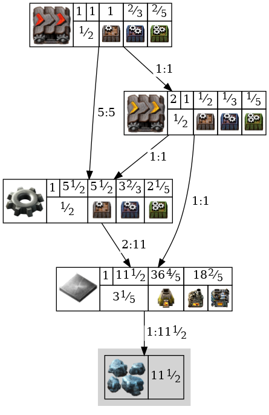
	
</details><details><summary>Express transport belt <a href="https://wiki.factorio.com/Express_transport_belt">[wiki]</a></summary>

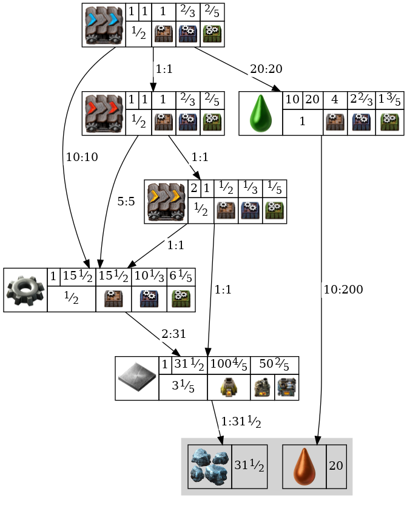
	
</details><details><summary>Underground belt <a href="https://wiki.factorio.com/Underground_belt">[wiki]</a></summary>


	
</details><details><summary>Fast underground belt <a href="https://wiki.factorio.com/Fast_underground_belt">[wiki]</a></summary>


	
</details><details><summary>Express underground belt <a href="https://wiki.factorio.com/Express_underground_belt">[wiki]</a></summary>


	
</details><details><summary>Splitter <a href="https://wiki.factorio.com/Splitter">[wiki]</a></summary>


	
</details><details><summary>Fast splitter <a href="https://wiki.factorio.com/Fast_splitter">[wiki]</a></summary>


	
</details><details><summary>Express splitter <a href="https://wiki.factorio.com/Express_splitter">[wiki]</a></summary>


	
</details><details><summary>Burner inserter <a href="https://wiki.factorio.com/Burner_inserter">[wiki]</a></summary>


	
</details><details><summary>Inserter <a href="https://wiki.factorio.com/Inserter">[wiki]</a></summary>


	
</details><details><summary>Long-handed inserter <a href="https://wiki.factorio.com/Long-handed_inserter">[wiki]</a></summary>


	
</details><details><summary>Fast inserter <a href="https://wiki.factorio.com/Fast_inserter">[wiki]</a></summary>

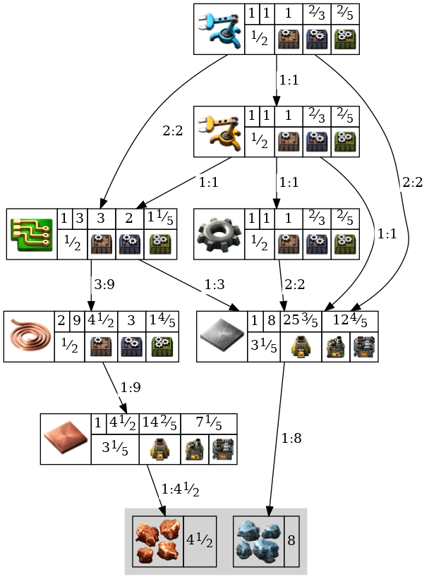
	
</details><details><summary>Filter inserter <a href="https://wiki.factorio.com/Filter_inserter">[wiki]</a></summary>


	
</details><details><summary>Stack inserter <a href="https://wiki.factorio.com/Stack_inserter">[wiki]</a></summary>


	
</details><details><summary>Stack filter inserter <a href="https://wiki.factorio.com/Stack_filter_inserter">[wiki]</a></summary>


	
</details><details><summary>Small electric pole <a href="https://wiki.factorio.com/Small_electric_pole">[wiki]</a></summary>

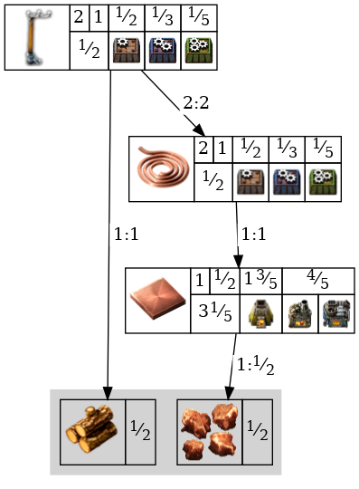
	
</details><details><summary>Medium electric pole <a href="https://wiki.factorio.com/Medium_electric_pole">[wiki]</a></summary>


	
</details><details><summary>Big electric pole <a href="https://wiki.factorio.com/Big_electric_pole">[wiki]</a></summary>


	
</details><details><summary>Substation <a href="https://wiki.factorio.com/Substation">[wiki]</a></summary>


	
</details><details><summary>Pipe <a href="https://wiki.factorio.com/Pipe">[wiki]</a></summary>


	
</details><details><summary>Pipe to ground <a href="https://wiki.factorio.com/Pipe_to_ground">[wiki]</a></summary>


	
</details><details><summary>Pump <a href="https://wiki.factorio.com/Pump">[wiki]</a></summary>


	
</details><details><summary>Straight rail <a href="https://wiki.factorio.com/Rail">[wiki]</a></summary>


	
</details><details><summary>Train stop <a href="https://wiki.factorio.com/Train_stop">[wiki]</a></summary>


	
</details><details><summary>Rail signal <a href="https://wiki.factorio.com/Rail_signal">[wiki]</a></summary>


	
</details><details><summary>Rail chain signal <a href="https://wiki.factorio.com/Rail_chain_signal">[wiki]</a></summary>


	
</details><details><summary>Locomotive <a href="https://wiki.factorio.com/Locomotive">[wiki]</a></summary>


	
</details><details><summary>Cargo wagon <a href="https://wiki.factorio.com/Cargo_wagon">[wiki]</a></summary>


	
</details><details><summary>Fluid wagon <a href="https://wiki.factorio.com/Fluid_wagon">[wiki]</a></summary>


	
</details><details><summary>Artillery wagon <a href="https://wiki.factorio.com/Artillery_wagon">[wiki]</a></summary>


	
</details><details><summary>Car <a href="https://wiki.factorio.com/Car">[wiki]</a></summary>


	
</details><details><summary>Tank <a href="https://wiki.factorio.com/Tank">[wiki]</a></summary>


	
</details><details><summary>Spidertron <a href="https://wiki.factorio.com/Spidertron">[wiki]</a></summary>


	
</details><details><summary>Spidertron remote <a href="https://wiki.factorio.com/Spidertron_remote">[wiki]</a></summary>


	
</details><details><summary>Logistic robot <a href="https://wiki.factorio.com/Logistic_robot">[wiki]</a></summary>


	
</details><details><summary>Construction robot <a href="https://wiki.factorio.com/Construction_robot">[wiki]</a></summary>


	
</details><details><summary>Active provider chest <a href="https://wiki.factorio.com/Active_provider_chest">[wiki]</a></summary>


	
</details><details><summary>Passive provider chest <a href="https://wiki.factorio.com/Passive_provider_chest">[wiki]</a></summary>


	
</details><details><summary>Storage chest <a href="https://wiki.factorio.com/Storage_chest">[wiki]</a></summary>


	
</details><details><summary>Buffer chest <a href="https://wiki.factorio.com/Buffer_chest">[wiki]</a></summary>


	
</details><details><summary>Requester chest <a href="https://wiki.factorio.com/Requester_chest">[wiki]</a></summary>


	
</details><details><summary>Roboport <a href="https://wiki.factorio.com/Roboport">[wiki]</a></summary>


	
</details><details><summary>Lamp <a href="https://wiki.factorio.com/Lamp">[wiki]</a></summary>


	
</details><details><summary>Red wire <a href="https://wiki.factorio.com/Red_wire">[wiki]</a></summary>


	
</details><details><summary>Green wire <a href="https://wiki.factorio.com/Green_wire">[wiki]</a></summary>


	
</details><details><summary>Arithmetic combinator <a href="https://wiki.factorio.com/Arithmetic_combinator">[wiki]</a></summary>


	
</details><details><summary>Decider combinator <a href="https://wiki.factorio.com/Decider_combinator">[wiki]</a></summary>


	
</details><details><summary>Constant combinator <a href="https://wiki.factorio.com/Constant_combinator">[wiki]</a></summary>


	
</details><details><summary>Power switch <a href="https://wiki.factorio.com/Power_switch">[wiki]</a></summary>


	
</details><details><summary>Programmable speaker <a href="https://wiki.factorio.com/Programmable_speaker">[wiki]</a></summary>


	
</details><details><summary>Stone brick <a href="https://wiki.factorio.com/Stone_brick">[wiki]</a></summary>


	
</details><details><summary>Concrete <a href="https://wiki.factorio.com/Concrete">[wiki]</a></summary>


	
</details><details><summary>Hazard concrete <a href="https://wiki.factorio.com/Hazard_concrete">[wiki]</a></summary>


	
</details><details><summary>Refined concrete <a href="https://wiki.factorio.com/Refined_concrete">[wiki]</a></summary>


	
</details><details><summary>Refined hazard concrete <a href="https://wiki.factorio.com/Refined_hazard_concrete">[wiki]</a></summary>


	
</details><details><summary>Landfill <a href="https://wiki.factorio.com/Landfill">[wiki]</a></summary>

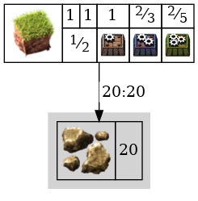
	
</details><details><summary>Cliff explosives <a href="https://wiki.factorio.com/Cliff_explosives">[wiki]</a></summary>


	
</details><details><summary>Repair pack <a href="https://wiki.factorio.com/Repair_pack">[wiki]</a></summary>


	
</details><details><summary>Blueprint <a href="https://wiki.factorio.com/Blueprint">[wiki]</a></summary>


	
</details><details><summary>Deconstruction planner <a href="https://wiki.factorio.com/Deconstruction_planner">[wiki]</a></summary>


	
</details><details><summary>Upgrade planner <a href="https://wiki.factorio.com/Upgrade_planner">[wiki]</a></summary>


	
</details><details><summary>Blueprint book <a href="https://wiki.factorio.com/Blueprint_book">[wiki]</a></summary>


	
</details><details><summary>Boiler <a href="https://wiki.factorio.com/Boiler">[wiki]</a></summary>


	
</details><details><summary>Steam engine <a href="https://wiki.factorio.com/Steam_engine">[wiki]</a></summary>


	
</details><details><summary>Solar panel <a href="https://wiki.factorio.com/Solar_panel">[wiki]</a></summary>


	
</details><details><summary>Accumulator <a href="https://wiki.factorio.com/Accumulator">[wiki]</a></summary>


	
</details><details><summary>Nuclear reactor <a href="https://wiki.factorio.com/Nuclear_reactor">[wiki]</a></summary>

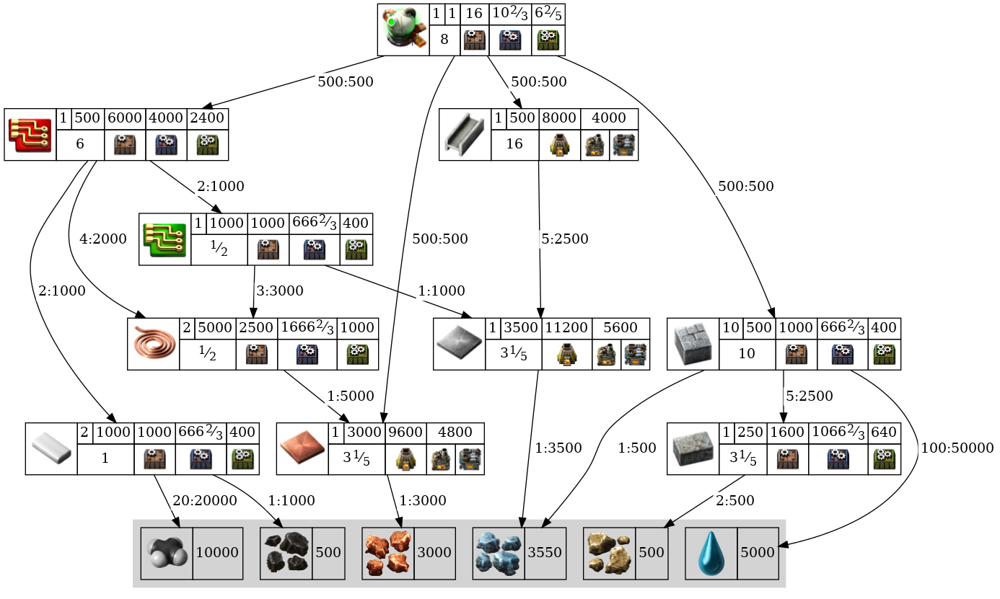
	
</details><details><summary>Heat pipe <a href="https://wiki.factorio.com/Heat_pipe">[wiki]</a></summary>


	
</details><details><summary>Heat exchanger <a href="https://wiki.factorio.com/Heat_exchanger">[wiki]</a></summary>


	
</details><details><summary>Steam turbine <a href="https://wiki.factorio.com/Steam_turbine">[wiki]</a></summary>


	
</details><details><summary>Burner mining drill <a href="https://wiki.factorio.com/Burner_mining_drill">[wiki]</a></summary>


	
</details><details><summary>Electric mining drill <a href="https://wiki.factorio.com/Electric_mining_drill">[wiki]</a></summary>


	
</details><details><summary>Offshore pump <a href="https://wiki.factorio.com/Offshore_pump">[wiki]</a></summary>


	
</details><details><summary>Pumpjack <a href="https://wiki.factorio.com/Pumpjack">[wiki]</a></summary>


	
</details><details><summary>Stone furnace <a href="https://wiki.factorio.com/Stone_furnace">[wiki]</a></summary>


	
</details><details><summary>Steel furnace <a href="https://wiki.factorio.com/Steel_furnace">[wiki]</a></summary>


	
</details><details><summary>Electric furnace <a href="https://wiki.factorio.com/Electric_furnace">[wiki]</a></summary>


	
</details><details><summary>Assembling machine 1 <a href="https://wiki.factorio.com/Assembling_machine_1">[wiki]</a></summary>


	
</details><details><summary>Assembling machine 2 <a href="https://wiki.factorio.com/Assembling_machine_2">[wiki]</a></summary>


	
</details><details><summary>Assembling machine 3 <a href="https://wiki.factorio.com/Assembling_machine_3">[wiki]</a></summary>


	
</details><details><summary>Oil refinery <a href="https://wiki.factorio.com/Oil_refinery">[wiki]</a></summary>


	
</details><details><summary>Chemical plant <a href="https://wiki.factorio.com/Chemical_plant">[wiki]</a></summary>


	
</details><details><summary>Centrifuge <a href="https://wiki.factorio.com/Centrifuge">[wiki]</a></summary>

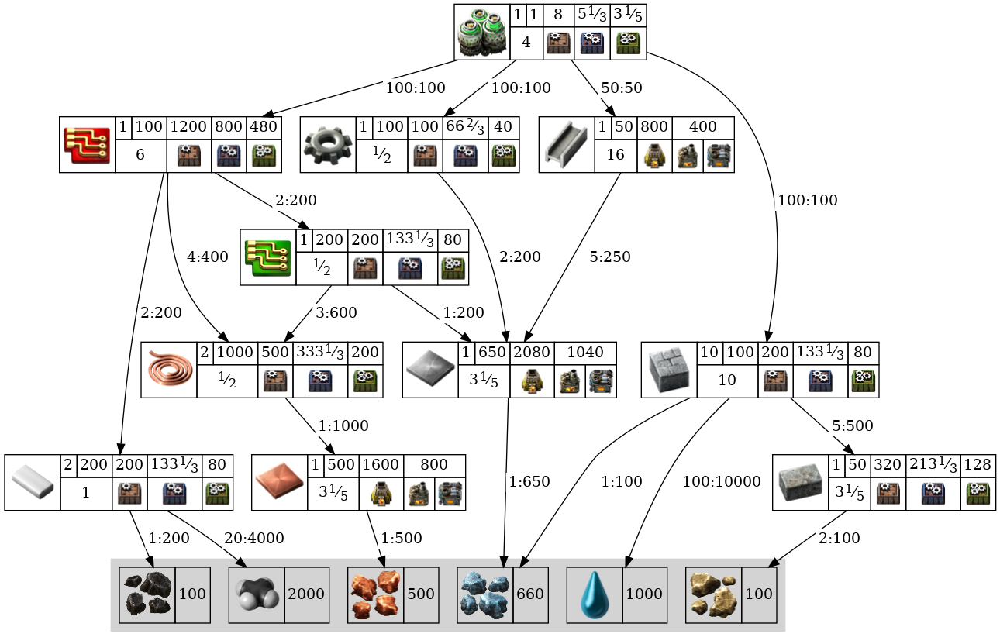
	
</details><details><summary>Lab <a href="https://wiki.factorio.com/Lab">[wiki]</a></summary>


	
</details><details><summary>Beacon <a href="https://wiki.factorio.com/Beacon">[wiki]</a></summary>


	
</details><details><summary>Speed module <a href="https://wiki.factorio.com/Speed_module">[wiki]</a></summary>


	
</details><details><summary>Speed module 2 <a href="https://wiki.factorio.com/Speed_module_2">[wiki]</a></summary>


	
</details><details><summary>Speed module 3 <a href="https://wiki.factorio.com/Speed_module_3">[wiki]</a></summary>


	
</details><details><summary>Efficiency module <a href="https://wiki.factorio.com/Efficiency_module">[wiki]</a></summary>

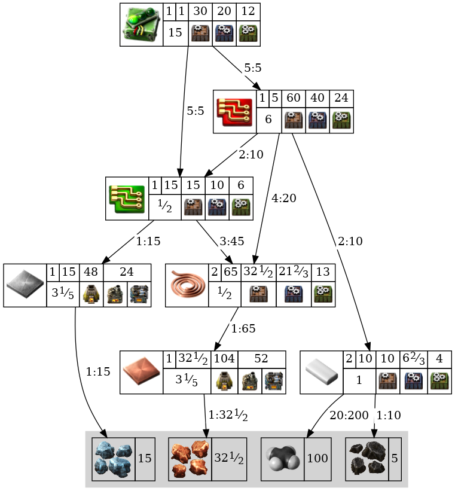
	
</details><details><summary>Efficiency module 2 <a href="https://wiki.factorio.com/Efficiency_module_2">[wiki]</a></summary>


	
</details><details><summary>Efficiency module 3 <a href="https://wiki.factorio.com/Efficiency_module_3">[wiki]</a></summary>


	
</details><details><summary>Productivity module <a href="https://wiki.factorio.com/Productivity_module">[wiki]</a></summary>


	
</details><details><summary>Productivity module 2 <a href="https://wiki.factorio.com/Productivity_module_2">[wiki]</a></summary>


	
</details><details><summary>Productivity module 3 <a href="https://wiki.factorio.com/Productivity_module_3">[wiki]</a></summary>


	
</details><details><summary>Rocket silo <a href="https://wiki.factorio.com/Rocket_silo">[wiki]</a></summary>


	
</details><details><summary>Satellite <a href="https://wiki.factorio.com/Satellite">[wiki]</a></summary>


	
</details><details><summary>Crude oil <a href="https://wiki.factorio.com/Crude_oil">[wiki]</a></summary>


	
</details><details><summary>Heavy oil <a href="https://wiki.factorio.com/Heavy_oil">[wiki]</a></summary>


	
</details><details><summary>Light oil <a href="https://wiki.factorio.com/Light_oil">[wiki]</a></summary>


	
</details><details><summary>Lubricant <a href="https://wiki.factorio.com/Lubricant">[wiki]</a></summary>

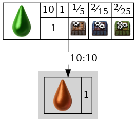
	
</details><details><summary>Petroleum gas <a href="https://wiki.factorio.com/Petroleum_gas">[wiki]</a></summary>


	
</details><details><summary>Sulfuric acid <a href="https://wiki.factorio.com/Sulfuric_acid">[wiki]</a></summary>


	
</details><details><summary>Water <a href="https://wiki.factorio.com/Water">[wiki]</a></summary>


	
</details><details><summary>Steam <a href="https://wiki.factorio.com/Steam">[wiki]</a></summary>


	
</details><details><summary>Wood <a href="https://wiki.factorio.com/Wood">[wiki]</a></summary>


	
</details><details><summary>Coal <a href="https://wiki.factorio.com/Coal">[wiki]</a></summary>


	
</details><details><summary>Stone <a href="https://wiki.factorio.com/Stone">[wiki]</a></summary>


	
</details><details><summary>Iron ore <a href="https://wiki.factorio.com/Iron_ore">[wiki]</a></summary>


	
</details><details><summary>Copper ore <a href="https://wiki.factorio.com/Copper_ore">[wiki]</a></summary>


	
</details><details><summary>Uranium ore <a href="https://wiki.factorio.com/Uranium_ore">[wiki]</a></summary>


	
</details><details><summary>Raw fish <a href="https://wiki.factorio.com/Raw_fish">[wiki]</a></summary>


	
</details><details><summary>Iron plate <a href="https://wiki.factorio.com/Iron_plate">[wiki]</a></summary>


	
</details><details><summary>Copper plate <a href="https://wiki.factorio.com/Copper_plate">[wiki]</a></summary>


	
</details><details><summary>Solid fuel <a href="https://wiki.factorio.com/Solid_fuel">[wiki]</a></summary>


	
</details><details><summary>Steel plate <a href="https://wiki.factorio.com/Steel_plate">[wiki]</a></summary>

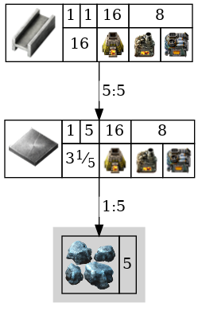
	
</details><details><summary>Plastic bar <a href="https://wiki.factorio.com/Plastic_bar">[wiki]</a></summary>


	
</details><details><summary>Sulfur <a href="https://wiki.factorio.com/Sulfur">[wiki]</a></summary>


	
</details><details><summary>Battery <a href="https://wiki.factorio.com/Battery">[wiki]</a></summary>


	
</details><details><summary>Explosives <a href="https://wiki.factorio.com/Explosives">[wiki]</a></summary>


	
</details><details><summary>Uranium processing <a href="https://wiki.factorio.com/Uranium_processing">[wiki]</a></summary>


	
</details><details><summary>Crude oil barrel <a href="https://wiki.factorio.com/Crude_oil_barrel">[wiki]</a></summary>


	
</details><details><summary>Heavy oil barrel <a href="https://wiki.factorio.com/Heavy_oil_barrel">[wiki]</a></summary>


	
</details><details><summary>Light oil barrel <a href="https://wiki.factorio.com/Light_oil_barrel">[wiki]</a></summary>


	
</details><details><summary>Lubricant barrel <a href="https://wiki.factorio.com/Lubricant_barrel">[wiki]</a></summary>


	
</details><details><summary>Petroleum gas barrel <a href="https://wiki.factorio.com/Petroleum_gas_barrel">[wiki]</a></summary>


	
</details><details><summary>Sulfuric acid barrel <a href="https://wiki.factorio.com/Sulfuric_acid_barrel">[wiki]</a></summary>


	
</details><details><summary>Water barrel <a href="https://wiki.factorio.com/Water_barrel">[wiki]</a></summary>


	
</details><details><summary>Copper cable <a href="https://wiki.factorio.com/Copper_cable">[wiki]</a></summary>


	
</details><details><summary>Iron stick <a href="https://wiki.factorio.com/Iron_stick">[wiki]</a></summary>


	
</details><details><summary>Iron gear wheel <a href="https://wiki.factorio.com/Iron_gear_wheel">[wiki]</a></summary>


	
</details><details><summary>Empty barrel <a href="https://wiki.factorio.com/Empty_barrel">[wiki]</a></summary>


	
</details><details><summary>Electronic circuit <a href="https://wiki.factorio.com/Electronic_circuit">[wiki]</a></summary>


	
</details><details><summary>Advanced circuit <a href="https://wiki.factorio.com/Advanced_circuit">[wiki]</a></summary>


	
</details><details><summary>Processing unit <a href="https://wiki.factorio.com/Processing_unit">[wiki]</a></summary>


	
</details><details><summary>Engine unit <a href="https://wiki.factorio.com/Engine_unit">[wiki]</a></summary>


	
</details><details><summary>Electric engine unit <a href="https://wiki.factorio.com/Electric_engine_unit">[wiki]</a></summary>


	
</details><details><summary>Flying robot frame <a href="https://wiki.factorio.com/Flying_robot_frame">[wiki]</a></summary>


	
</details><details><summary>Rocket part <a href="https://wiki.factorio.com/Rocket_part">[wiki]</a></summary>


	
</details><details><summary>Rocket control unit <a href="https://wiki.factorio.com/Rocket_control_unit">[wiki]</a></summary>


	
</details><details><summary>Low density structure <a href="https://wiki.factorio.com/Low_density_structure">[wiki]</a></summary>


	
</details><details><summary>Rocket fuel <a href="https://wiki.factorio.com/Rocket_fuel">[wiki]</a></summary>


	
</details><details><summary>Nuclear fuel <a href="https://wiki.factorio.com/Nuclear_fuel">[wiki]</a></summary>


	
</details><details><summary>Uranium-235 <a href="https://wiki.factorio.com/Uranium-235">[wiki]</a></summary>


	
</details><details><summary>Uranium-238 <a href="https://wiki.factorio.com/Uranium-238">[wiki]</a></summary>


	
</details><details><summary>Uranium fuel cell <a href="https://wiki.factorio.com/Uranium_fuel_cell">[wiki]</a></summary>


	
</details><details><summary>Nuclear fuel reprocessing <a href="https://wiki.factorio.com/Nuclear_fuel_reprocessing">[wiki]</a></summary>


	
</details><details><summary>Kovarex enrichment process <a href="https://wiki.factorio.com/Kovarex_enrichment_process">[wiki]</a></summary>


	
</details><details><summary>Used up uranium fuel cell <a href="https://wiki.factorio.com/Used_up_uranium_fuel_cell">[wiki]</a></summary>


	
</details><details><summary>Automation science pack <a href="https://wiki.factorio.com/Automation_science_pack">[wiki]</a></summary>


	
</details><details><summary>Logistic science pack <a href="https://wiki.factorio.com/Logistic_science_pack">[wiki]</a></summary>


	
</details><details><summary>Military science pack <a href="https://wiki.factorio.com/Military_science_pack">[wiki]</a></summary>


	
</details><details><summary>Chemical science pack <a href="https://wiki.factorio.com/Chemical_science_pack">[wiki]</a></summary>


	
</details><details><summary>Production science pack <a href="https://wiki.factorio.com/Production_science_pack">[wiki]</a></summary>


	
</details><details><summary>Utility science pack <a href="https://wiki.factorio.com/Utility_science_pack">[wiki]</a></summary>


	
</details><details><summary>Space science pack <a href="https://wiki.factorio.com/Space_science_pack">[wiki]</a></summary>


	
</details><details><summary>Pistol <a href="https://wiki.factorio.com/Pistol">[wiki]</a></summary>


	
</details><details><summary>Submachine gun <a href="https://wiki.factorio.com/Submachine_gun">[wiki]</a></summary>


	
</details><details><summary>Shotgun <a href="https://wiki.factorio.com/Shotgun">[wiki]</a></summary>


	
</details><details><summary>Combat shotgun <a href="https://wiki.factorio.com/Combat_shotgun">[wiki]</a></summary>


	
</details><details><summary>Rocket launcher <a href="https://wiki.factorio.com/Rocket_launcher">[wiki]</a></summary>


	
</details><details><summary>Flamethrower <a href="https://wiki.factorio.com/Flamethrower">[wiki]</a></summary>


	
</details><details><summary>Land mine <a href="https://wiki.factorio.com/Land_mine">[wiki]</a></summary>


	
</details><details><summary>Firearm magazine <a href="https://wiki.factorio.com/Firearm_magazine">[wiki]</a></summary>


	
</details><details><summary>Piercing rounds magazine <a href="https://wiki.factorio.com/Piercing_rounds_magazine">[wiki]</a></summary>


	
</details><details><summary>Uranium rounds magazine <a href="https://wiki.factorio.com/Uranium_rounds_magazine">[wiki]</a></summary>


	
</details><details><summary>Shotgun shells <a href="https://wiki.factorio.com/Shotgun_shells">[wiki]</a></summary>


	
</details><details><summary>Piercing shotgun shells <a href="https://wiki.factorio.com/Piercing_shotgun_shells">[wiki]</a></summary>


	
</details><details><summary>Cannon shell <a href="https://wiki.factorio.com/Cannon_shell">[wiki]</a></summary>


	
</details><details><summary>Explosive cannon shell <a href="https://wiki.factorio.com/Explosive_cannon_shell">[wiki]</a></summary>


	
</details><details><summary>Uranium cannon shell <a href="https://wiki.factorio.com/Uranium_cannon_shell">[wiki]</a></summary>


	
</details><details><summary>Explosive uranium cannon shell <a href="https://wiki.factorio.com/Explosive_uranium_cannon_shell">[wiki]</a></summary>


	
</details><details><summary>Artillery shell <a href="https://wiki.factorio.com/Artillery_shell">[wiki]</a></summary>


	
</details><details><summary>Rocket <a href="https://wiki.factorio.com/Rocket">[wiki]</a></summary>


	
</details><details><summary>Explosive rocket <a href="https://wiki.factorio.com/Explosive_rocket">[wiki]</a></summary>


	
</details><details><summary>Atomic bomb <a href="https://wiki.factorio.com/Atomic_bomb">[wiki]</a></summary>


	
</details><details><summary>Flamethrower ammo <a href="https://wiki.factorio.com/Flamethrower_ammo">[wiki]</a></summary>


	
</details><details><summary>Grenade <a href="https://wiki.factorio.com/Grenade">[wiki]</a></summary>


	
</details><details><summary>Cluster grenade <a href="https://wiki.factorio.com/Cluster_grenade">[wiki]</a></summary>


	
</details><details><summary>Poison capsule <a href="https://wiki.factorio.com/Poison_capsule">[wiki]</a></summary>


	
</details><details><summary>Slowdown capsule <a href="https://wiki.factorio.com/Slowdown_capsule">[wiki]</a></summary>


	
</details><details><summary>Defender capsule <a href="https://wiki.factorio.com/Defender_capsule">[wiki]</a></summary>


	
</details><details><summary>Distractor capsule <a href="https://wiki.factorio.com/Distractor_capsule">[wiki]</a></summary>


	
</details><details><summary>Destroyer capsule <a href="https://wiki.factorio.com/Destroyer_capsule">[wiki]</a></summary>


	
</details><details><summary>Light armor <a href="https://wiki.factorio.com/Light_armor">[wiki]</a></summary>


	
</details><details><summary>Heavy armor <a href="https://wiki.factorio.com/Heavy_armor">[wiki]</a></summary>


	
</details><details><summary>Modular armor <a href="https://wiki.factorio.com/Modular_armor">[wiki]</a></summary>


	
</details><details><summary>Power armor <a href="https://wiki.factorio.com/Power_armor">[wiki]</a></summary>


	
</details><details><summary>Power armor MK2 <a href="https://wiki.factorio.com/Power_armor_MK2">[wiki]</a></summary>


	
</details><details><summary>Portable solar panel <a href="https://wiki.factorio.com/Portable_solar_panel">[wiki]</a></summary>


	
</details><details><summary>Portable fusion reactor <a href="https://wiki.factorio.com/Portable_fusion_reactor">[wiki]</a></summary>


	
</details><details><summary>Personal battery <a href="https://wiki.factorio.com/Personal_battery">[wiki]</a></summary>

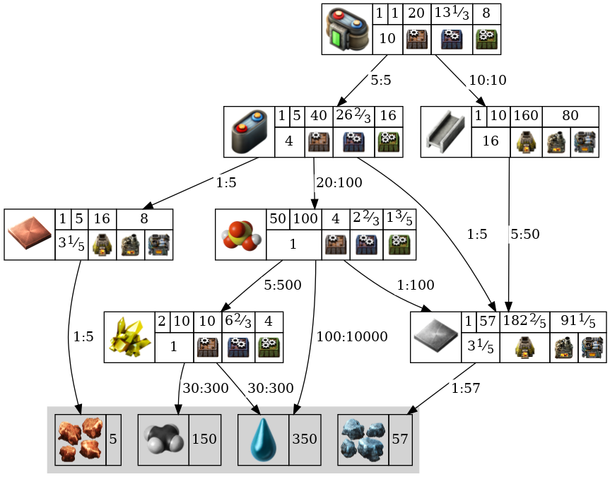
	
</details><details><summary>Personal battery MK2 <a href="https://wiki.factorio.com/Personal_battery_MK2">[wiki]</a></summary>


	
</details><details><summary>Belt immunity equipment <a href="https://wiki.factorio.com/Belt_immunity_equipment">[wiki]</a></summary>


	
</details><details><summary>Exoskeleton <a href="https://wiki.factorio.com/Exoskeleton">[wiki]</a></summary>


	
</details><details><summary>Personal roboport <a href="https://wiki.factorio.com/Personal_roboport">[wiki]</a></summary>


	
</details><details><summary>Personal roboport MK2 <a href="https://wiki.factorio.com/Personal_roboport_MK2">[wiki]</a></summary>


	
</details><details><summary>Nightvision <a href="https://wiki.factorio.com/Nightvision">[wiki]</a></summary>


	
</details><details><summary>Energy shield <a href="https://wiki.factorio.com/Energy_shield">[wiki]</a></summary>


	
</details><details><summary>Energy shield MK2 <a href="https://wiki.factorio.com/Energy_shield_MK2">[wiki]</a></summary>


	
</details><details><summary>Personal laser defense <a href="https://wiki.factorio.com/Personal_laser_defense">[wiki]</a></summary>


	
</details><details><summary>Discharge defense <a href="https://wiki.factorio.com/Discharge_defense">[wiki]</a></summary>

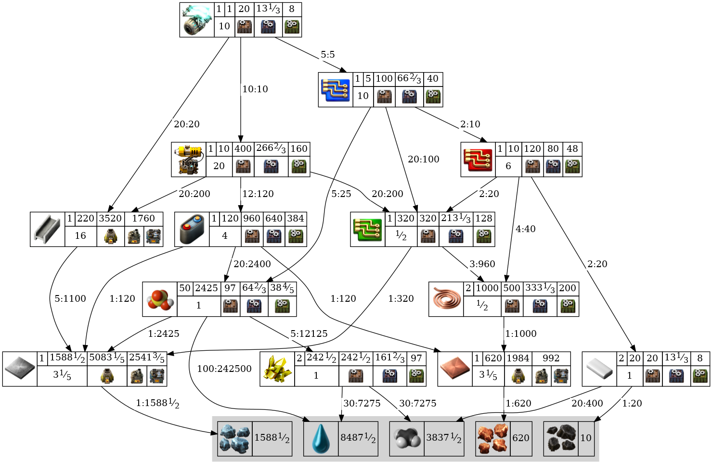
	
</details><details><summary>Discharge defense remote <a href="https://wiki.factorio.com/Discharge_defense_remote">[wiki]</a></summary>


	
</details><details><summary>Wall <a href="https://wiki.factorio.com/Wall">[wiki]</a></summary>


	
</details><details><summary>Gate <a href="https://wiki.factorio.com/Gate">[wiki]</a></summary>


	
</details><details><summary>Gun turret <a href="https://wiki.factorio.com/Gun_turret">[wiki]</a></summary>


	
</details><details><summary>Laser turret <a href="https://wiki.factorio.com/Laser_turret">[wiki]</a></summary>


	
</details><details><summary>Flamethrower turret <a href="https://wiki.factorio.com/Flamethrower_turret">[wiki]</a></summary>


	
</details><details><summary>Artillery turret <a href="https://wiki.factorio.com/Artillery_turret">[wiki]</a></summary>


	
</details><details><summary>Artillery targeting remote <a href="https://wiki.factorio.com/Artillery_targeting_remote">[wiki]</a></summary>


	
</details><details><summary>Radar <a href="https://wiki.factorio.com/Radar">[wiki]</a></summary>


	
</details>